# Authentication

The .NET Podcast can be configured to use authentication from an OAuth provider. The `feeds` route has been configured to allow updates and deletions only from authenticated clients. This guide assumes that Azure Active Directory will be used as the authentication provider.

## Prerequisites

- An Azure account with an active subscription. If you don't have an Azure subscription, create a [free account](https://azure.microsoft.com/free/) before you begin.

- Deploy the dotnet-podcasts application. Follow the detailed guidelines [here](../../deploy-websites-services.md).

- Azure Active Directory has been configured for a domain. Follow the [Create and configure an Azure Active Directory Domain Services managed domain](https://learn.microsoft.com/azure/active-directory-domain-services/tutorial-create-instance) tutorial, if you do not currently have domain services configured.

- The .NET CLI will need to be installed and configured. See the [.NET CLI overview](https://learn.microsoft.com/dotnet/core/tools/) for more information and how to install the .NET SDK.

## Configure Azure Active Directory

1. Sign in to the [Azure Portal](https://portal.azure.com)
1. Select the `Azure Active Directory` option from the side menu

   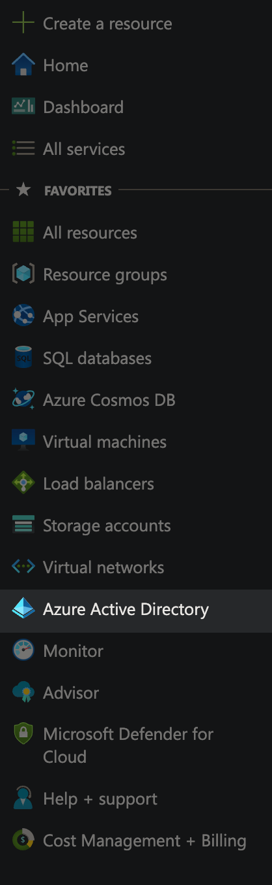
1. Select the `App registrations` option from the Azure Active Directory side menu.
   
   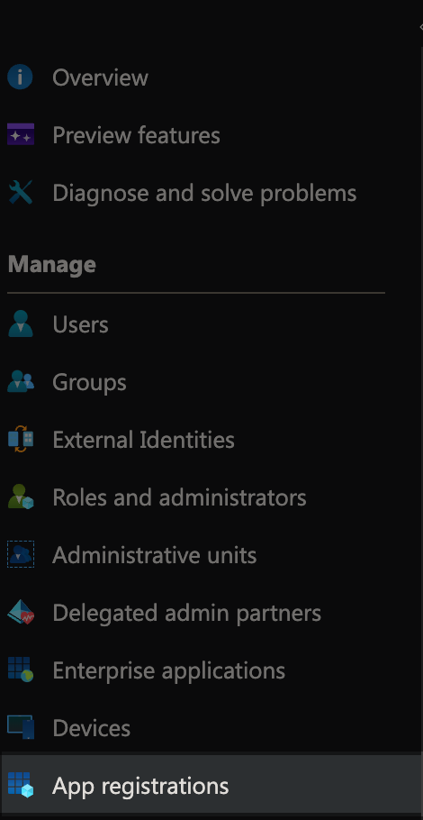
1. Select the `New registration` option from the Azure Active Directory top menu.
   
   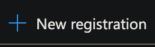
1. On the `Register an application` page, provide a name for the application and select `Register`.
   
   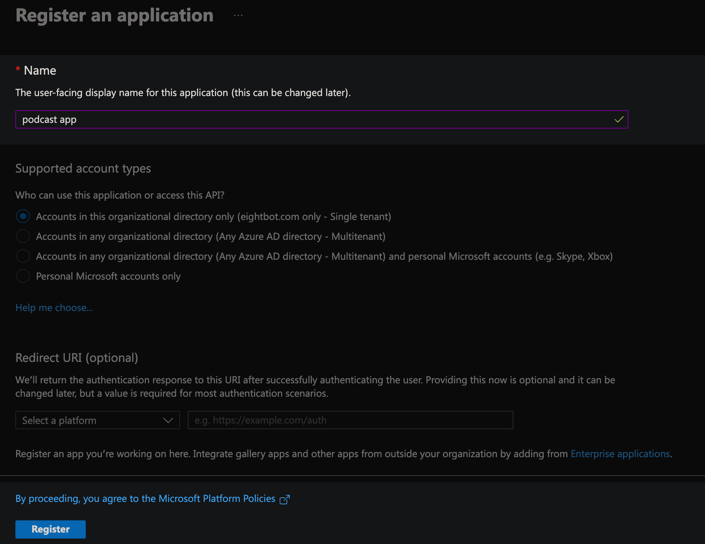
1. On the app registration overview page, take note of the `Application (client) ID` and `Directory (tenant) ID` as we will need this information for a later step.
1. Select the `Manage > App Roles` side menu option from the app registration management page.
   
   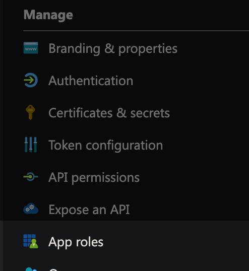
1. Select the `Create app role` option from the App roles top menu.
   
   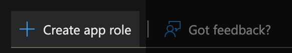
1. Configure the app role with the following information and select `Apply`.
   
   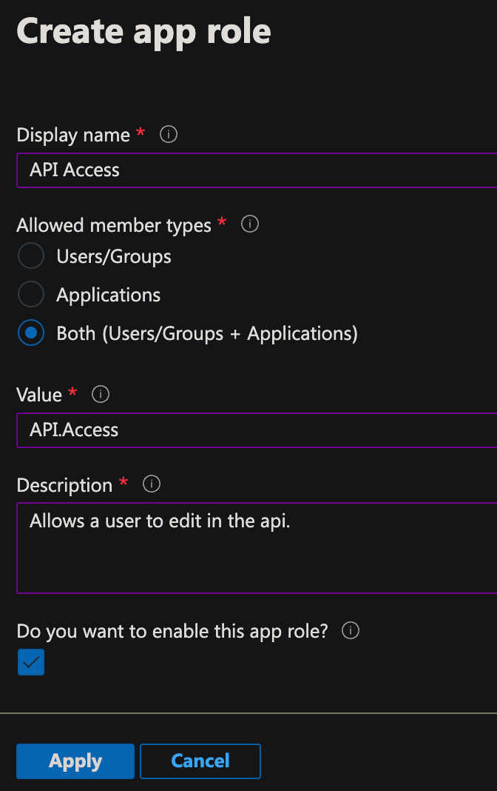

   | Configuration                        | Value                                |
   | ------------------------------------ | ------------------------------------ |
   | Display Name                         | `API Access`                         |
   | Allowed member types                 | `Both (Users/Groups + Applications)` |
   | Value                                | `API.Access`                         |
   | Description                          | `Allows a user to edit in the api.`  |
   | Do you want to enable this app role? | `Enabled`                            |

## Enable Authentication in the Podcast.API

1. In the `Podcast.API` project, open the `appsettings.json` (or environment specific file such as `appsettings.Development.json`).
1. Add a new top-level property of `AzureAd` with the following configurations. The `{DOMAIN}`, `{AZURE_AD_TENANT_ID}`, and `{AZURE_AD_CLIENT_ID}` will need to be replaced with values captured earlier when configuring your app registration.

   ```json
   {
     "Logging": {
       "LogLevel": {
         "Default": "Information",
         "Microsoft": "Warning",
         "Microsoft.Hosting.Lifetime": "Information"
       }
     },
     "ConnectionStrings": {
       "PodcastDb": "Server=localhost, 5433;Database=Podcast;User Id=sa;Password=Pass@word;Encrypt=False",
       "FeedQueue": "UseDevelopmentStorage=true"
     },
     "AzureAd": {
       "Instance": "https://login.microsoftonline.com/",
       "Domain": "{DOMAIN}",
       "TenantId": "{AZURE_AD_TENANT_ID}",
       "ClientId": "{AZURE_AD_CLIENT_ID}"
     },
     "Authentication": {
       "Schemes": {
         "Bearer": {
           "ValidAudiences": ["1ba2c41d-3a54-414a-9700-1f9393cfafca"],
           "ValidIssuer": "dotnet-user-jwts"
         }
       }
     }
   }
   ```

1. Uncomment the following line from the `Program.cs` file.

   ```csharp
   builder.Services.AddMicrosoftIdentityWebApiAuthentication(builder.Configuration);
   ```

1. Start debugging or deploying your application.

### Testing Configurations

1. Using a terminal with .NET CLI available, navigate to the folder that contains the `Podcast.API` project and execute the following command. The `{TENANT_ID}` parameter will need to be replaced with the tenant id captured earlier when configuring your app registration.

   ```dotnetcli
   dotnet user-jwts create --audience 1ba2c41d-3a54-414a-9700-1f9393cfafca --claim "scp=API.Access" --claim "tid={TENANT_ID}"
   ```

1. When this executes, it will generate a new `Token`. Select the token value for later use.

   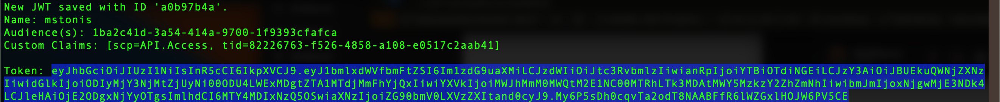
1. Navigate to the `Podcast.API` swagger page. If debugging it may be `https://localhost:5001/swagger/index.html`.
1. Select the `Authorize` button, add the `Token` value generated previously, select `Authorize`, and select `Close`.
   
   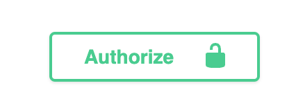
   
   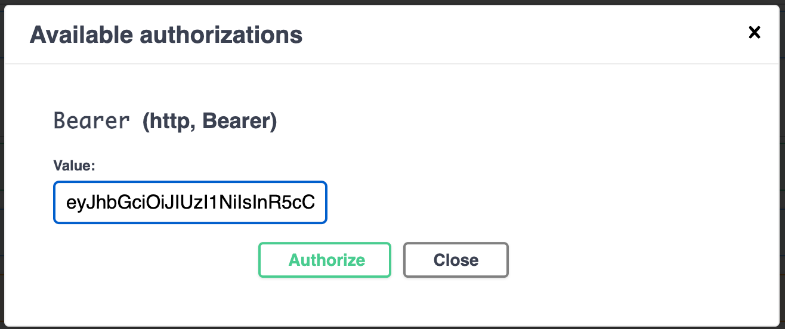
1. Using the swagger UI, expand the `Get /feeds` option and `Execute`. From the response body, select the `id` value from one of the returned feed items.
   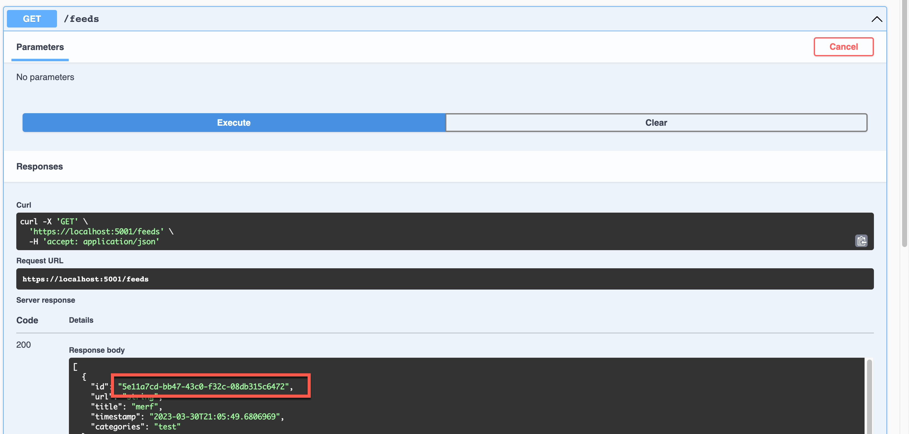
1. Using the swagger UI, expand the `Delete /feeds` option, select the `try it out` option, paste the `id` copied from the previous step into the `id` field, and `Execute`. If everything is authenticated successfully, you will receive a `204` code.
   
   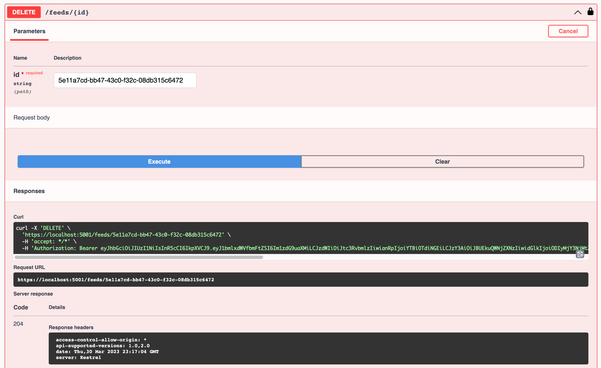
