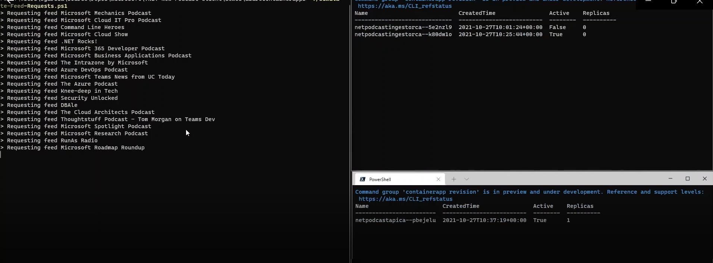
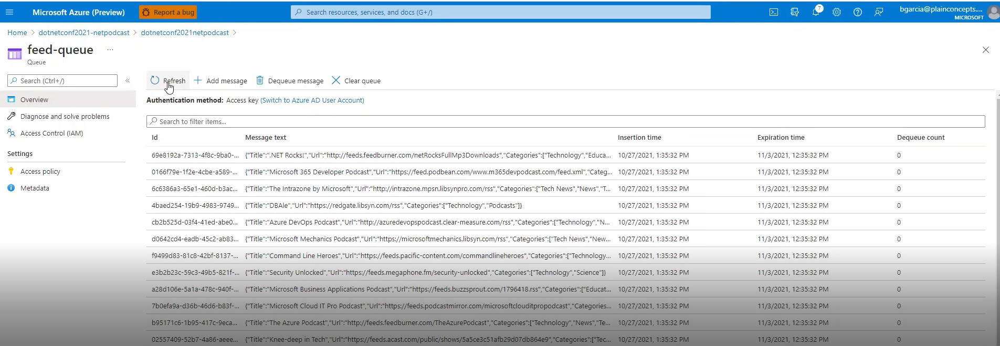
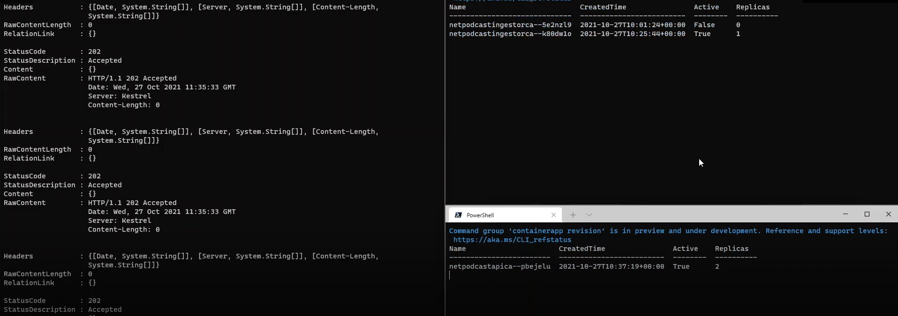

# Azure Container Apps

This folder contains additional scripts needed for testing the Azure Container Apps scenario.

You must first enable the _feeds_ injestion API by turning it on in the `api.bicep` file on [line 27](https://github.com/microsoft/dotnet-podcasts/blob/main/deploy/Services/api.bicep#L27). 

```bicep
var deployIngestion = true
```

## Demo steps:

1. Get the HTTP API application details:

    ```cli
    az containerapp show -g "$RESOURCE_GROUP_NAME" -n podcastapi
    ```

2. Look for the application's address in the `fqdn` field in the `ingress` config section:

    ```
    "configuration": {
        "ingress": {
        "external": true,
        "fqdn": "<FQDN>",
        "targetPort": 80,
        "transport": "auto"
        },
    ```
 3. Browse the HTTP API to confirm It works.

    ```
    https://<FQDN>
    ````

4. Open a PowerShell terminal and watch Container Apps:

- `podcastingestionca`: Worker service that scale based on queue messages. When the queue is empty the container app should have 1 instances.

    ```bicep
    scale: {
        maxReplicas: 5
        minReplicas: 1
        rules: [
          {
            name: 'queue-scaling-rule'
            azureQueue: {
              queueName: 'feed-queue'
              queueLength: 20
              auth: [
                {
                  secretRef: 'feedqueue'
                  triggerParameter: 'connection'
                }
              ]
            }
          }
        ]
      }
    ```

- `podcastapica`: HTTP API that scale based on concurrent HTTP requests. When there are no incoming requests the container app should have 0 instances.

     ```bicep
    scale: {
        minReplicas: 0
        maxReplicas: 5
        rules: [
          {
            name: 'httpscalingrule'
            http: {
              metadata: {
                concurrentRequests: '20'
              }
            }
          }
        ]
      }
    ```
    4.1 Run this commands to watch container apps scaling out.

    ```ps1
    while (1) { 
        $output = az containerapp revision list -n podcastapica -g dotnetconf2021-netpodcast --query "[?properties.active].{Name:properties.name, CreatedTime:properties.createdTime, Active:properties.active, Replicas:properties.replicas}" -o table --only-show-errors
        clear;
        echo $output;
        sleep 2;
    }
    ```
    ```ps1
    while (1) { 
        $output = az containerapp revision list -n podcastingestionca -g dotnetconf2021-netpodcast --query "[?properties.active].{Name:properties.name, CreatedTime:properties.createdTime, Active:properties.active, Replicas:properties.replicas}" -o table --only-show-errors
        clear;
        echo $output;
        sleep 2;
    }
    ```
    ```ps1
        while (1) { 
        $output = ./MessageCount.ps1 -storageAccount <storageAccountName> -accessKey <accessKey>
        clear;
        echo $output;
        sleep 1;
    }
    ```

    

5. Simulate some load sending POST requests to the HTTP API. You should see new messages appearing in the Azure Storage Queue. (feed-queue).

    ```ps1
    ./Simulate-Feed-Requests.ps1 -baseUrl https://<FQDN>/
    ```

    

6. Observe how the HTTP API and the worker scale out.

    
