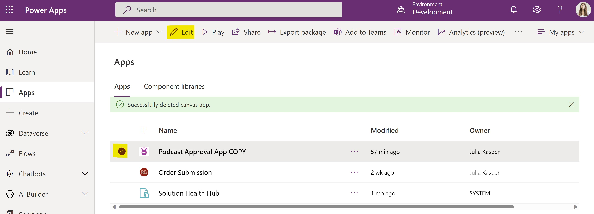
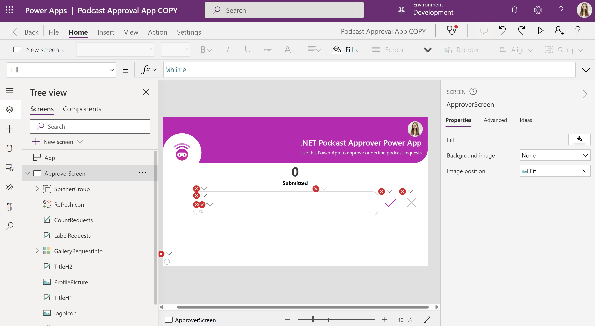
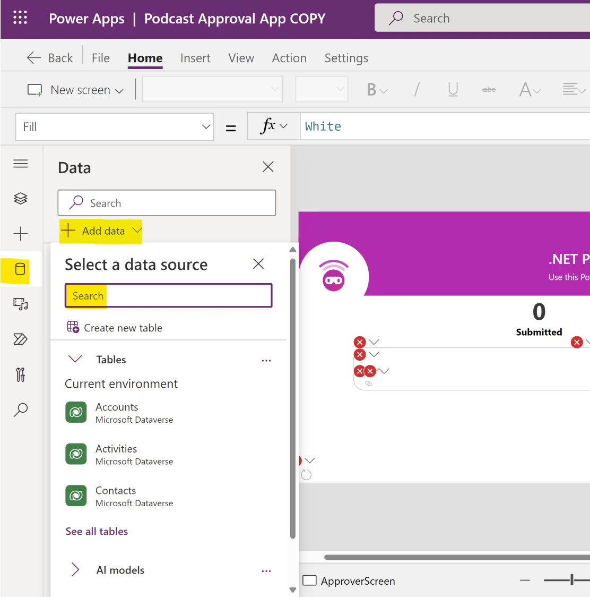
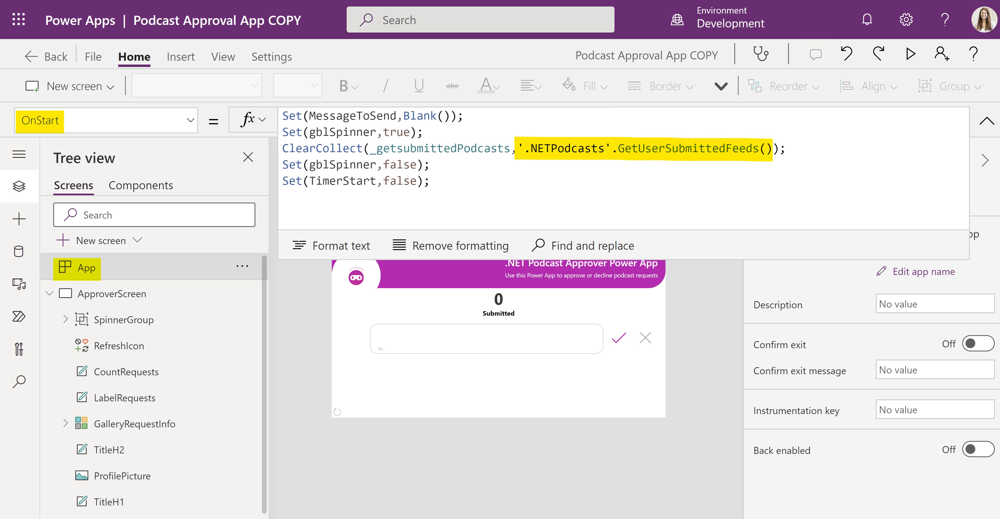
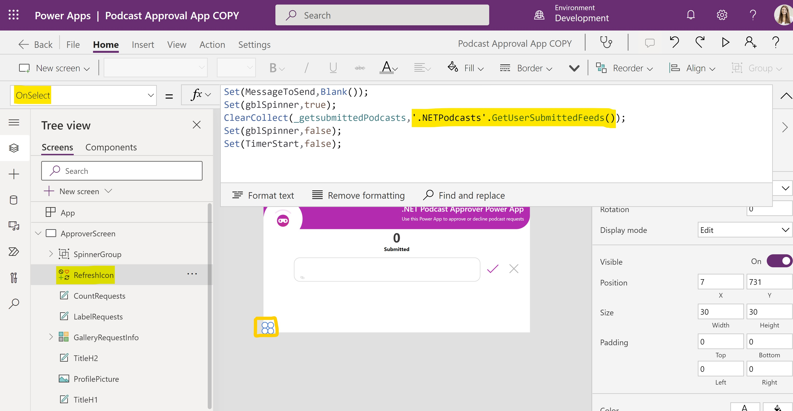

# Connecting APIs to the Microsoft Power Platform

Before getting started, ensure that you have successfully imported the Approval App into your Power Apps environment. For more information, see this [tutorial](https://github.com/user/repo/src/PowerApps/README.md).

# Create a custom connector

[Custom connectors](https://docs.microsoft.com/en-us/connectors/custom-connectors/) are a powerful way to connect to any existing API from within Power Apps. A custom connector is a wrapper around a REST API that allows the Power Platform to communicate with your REST API.

From within Azure API Management, you can easily create such custom connectors. [Follow the tutorial](https://docs.microsoft.com/en-us/azure/api-management/export-api-power-platform) on how to export your API from API Management.

# Connect your Podcast Approval application with your web API

Open the Podcast Approval App within Power Apps:

There will be some error messages within the Power App:

To fix these, add the custom connector to the Approval App via the data tab:

*Note: Search for the name of your custom connector created via API Management. If you have enabled [subscriptions within API Management](https://learn.microsoft.com/en-us/azure/api-management/api-management-subscriptions), you need to provide an API key to the consumer to access the API. Please read this article to find out how to [access subscription keys within API Management](https://learn.microsoft.com/en-us/azure/api-management/api-management-howto-create-subscriptions#create-a-new-subscription).*

# Modify your Power App

Next, update your Power App via the Power Editor.

## OnStart

Every time the Power App starts up, we want to make an API call getting us the information about current requests. For this, change the [OnStart behavior](https://docs.microsoft.com/en-us/power-platform/power-fx/reference/object-app) and modify **'.NETPodcasts'.GetUserSubmittedFeeds()**:

Additional Information:
- **'.NETPodcasts'** is referencing the name of the custom connector
- **GetUserSubmittedFeeds()** is referencing the API's operation name

# Refresh Button

Next, update the refresh button properties by modifiying **'.NETPodcasts'.GetUserSubmittedFeeds()**:
