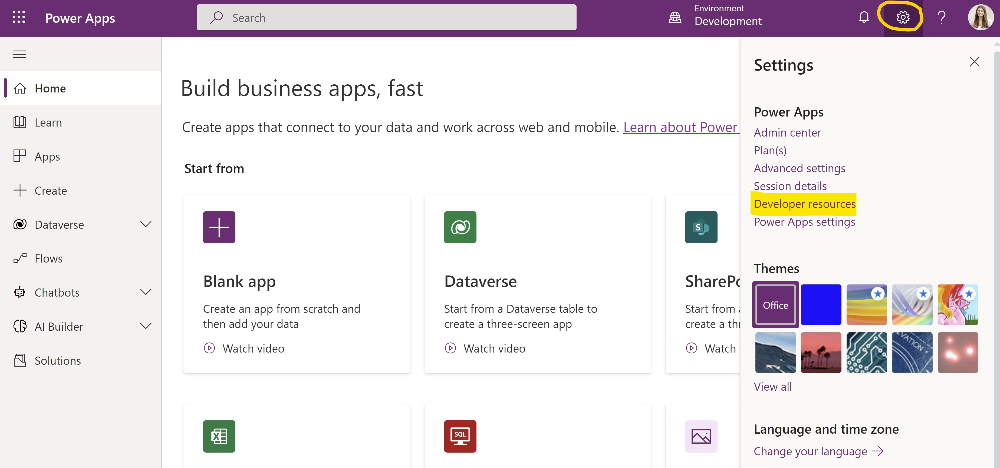
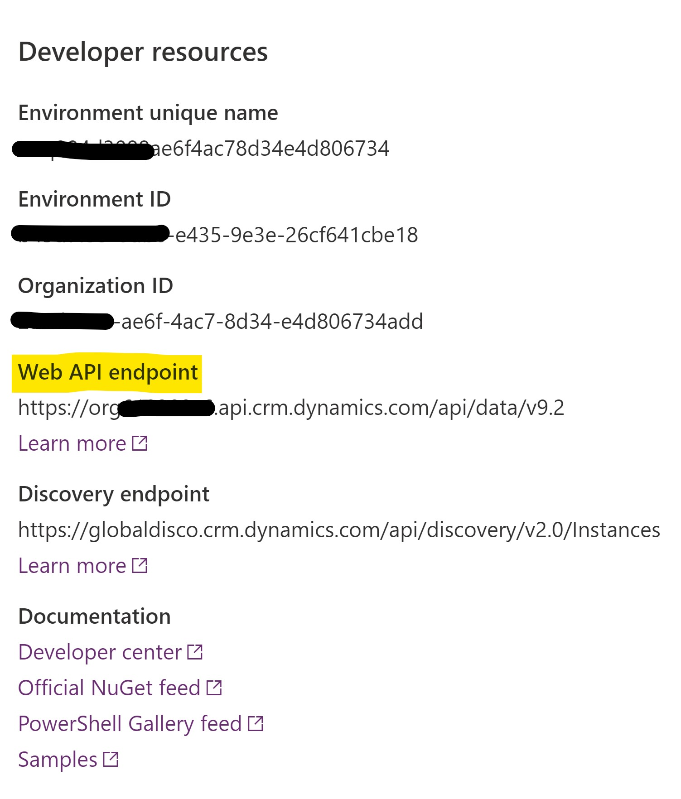
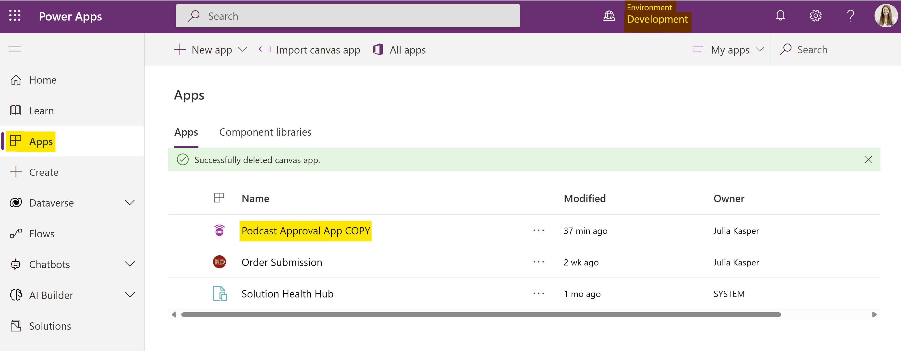

# Podcast Approval App using Microsoft Power Apps

Before getting started, ensure that you have access to [Microsoft Power Platform](https://make.powerapps.com/) and the latest version of the [Microsoft Power Platform CLI](https://docs.microsoft.com/de-de/power-platform/developer/cli/introduction) or sign up for the [Power Apps Developer Plan](https://docs.microsoft.com/en-us/power-apps/maker/developer-plan).

The solution folder is located in **/src/PowerApps/Solution.zip**. Please download the zip file.
Before building the Power App, we need to import the solution into our [Power Platform environment](https://docs.microsoft.com/en-us/power-platform/admin/environments-overview).

# Importing Power Apps solution

Open PowerShell and install the latest version of the PAC CLI:

```PowerShell
pac install latest
```

## Authenticate & Select Environment

Before importing any solution, authenticate to the right Power Platform environment using the PAC CLI, [pac auth](https://docs.microsoft.com/en-us/power-platform/developer/cli/reference/auth):

```PowerShell
pac auth create --url https://org4xxxxxxx.api.crm4.dynamics.com
```

You can get your environment URL from Power Platform Developer resources:





## Import solution file

Next, import the solution using the PAC CLI [pac solution import](https://docs.microsoft.com/en-us/power-platform/developer/cli/reference/solution):

```PowerShell
pac solution import --path C:\Users\name\Downloads\Solution.zip
```

## Open up your Power App

Once your solution has been succesfully imported into your selected Power Platform environment, you can now find and edit your Power App:




# Next Steps

Integrate your back-end services with your Power App. [Follow detailed guidelines](https://github.com/user/repo/demos/powerapps/README.md) to connect your web API with your Power App. 